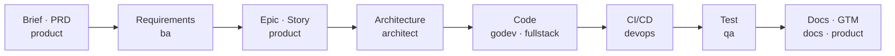

# KubeRocketCI Claude Code Plugins

[](https://docs.claude.com/en/docs/claude-code)
[](#plugins)
[](.github/workflows/check-plugin-version.yml)
[](LICENSE)

AI agents for the software development lifecycle on [KubeRocketCI](https://kuberocketci.io) — plan, build, ship, test, document.

## What this gets you

One team of agents, idea to shipped — a plugin owns every stage:



`krci-general` (commit, code review) and `krci-help` (advisor) assist at every stage.

## What you can do

- Plan a feature across repos → **krci-architect**
- Ship a Go operator or CRD → **krci-godev**
- Build a portal screen (React/tRPC) → **krci-fullstack**
- Onboard a Tekton pipeline or GitLab CI → **krci-devops**
- Write PRDs, epics, stories, go-to-market → **krci-product**
- Gather requirements & business rules → **krci-ba**
- Plan & run tests, report defects → **krci-qa**
- Review docs & slides → **krci-docs**
- Generate commits & review code → **krci-general**

## Installation

```bash
claude plugin marketplace add KubeRocketCI/claude-plugins
claude plugin install krci-help krci-architect krci-fullstack krci-godev krci-devops krci-general krci-ba krci-product krci-qa krci-docs
```

## Plugins

| Plugin             | Scope    | Domain                                                        |
|--------------------|----------|---------------------------------------------------------------|
| **krci-help**      | KRCI     | Ecosystem guide, SDLC map, multi-repo workspace provisioning  |
| **krci-architect** | KRCI     | Cross-repo feature planning, design validation                |
| **krci-godev**     | KRCI     | Go, Kubernetes operators, CRDs, controller reconciliation     |
| **krci-fullstack** | KRCI     | React/TypeScript/Radix/tRPC portal development                |
| **krci-devops**    | KRCI     | Tekton pipeline/task/trigger + GitLab CI components           |
| **krci-general**   | agnostic | Commit messages, code review (any language)                   |
| **krci-ba**        | agnostic | Requirements, processes, business rules, user journeys        |
| **krci-product**   | agnostic | PRDs, epics, stories, charters, go-to-market                  |
| **krci-qa**        | agnostic | Test plans, test cases, execution, defects, Gherkin           |
| **krci-docs**      | agnostic | Doc and presentation review (Microsoft Writing Style Guide)   |

## Where do I start?

Run `/krci-help:help` for the full map of every agent, command, and skill — or ask the **advisor** agent which plugin fits your task. That map lives inside the plugin, so it never goes stale here.

## Contributing

Every PR that touches `plugins/<name>/` **must** bump the `version` in that plugin's `.claude-plugin/plugin.json` ([semver](https://semver.org): PATCH = fixes, MINOR = new/changed behavior, MAJOR = breaking). CI blocks the merge otherwise. See [CLAUDE.md](CLAUDE.md) for conventions.

## License

Apache-2.0
